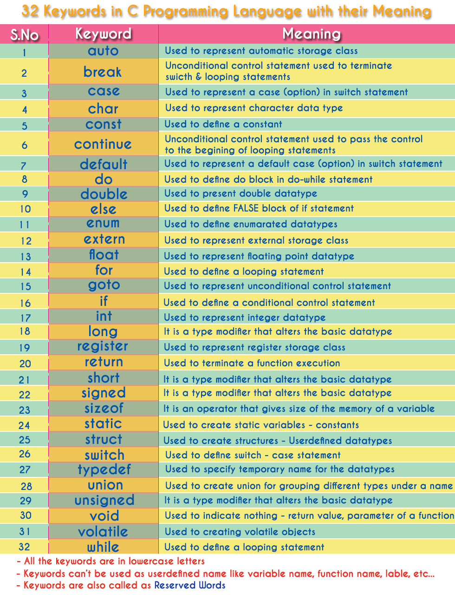

C Keywords
As every language has words to construct statements, 
C programming also has words with a specific meaning which are used to construct c program instructions. 
In the C programming language, keywords are special words with predefined meaning. 
Keywords are also known as reserved words in C programming language.

In the C programming language, there are 32 keywords.
 All the 32 keywords have their meaning which is already known to the compiler.

>Keywords are the reserved words with predefined meaning which already known to the compiler

Whenever C compiler come across a keyword, automatically it understands its meaning.

### Properties of Keywords

All the keywords in C programming language are defined as lowercase letters so they must be used only in lowercase letters
Every keyword has a specific meaning, users can not change that meaning.
Keywords can not be used as user-defined names like variable, functions, arrays, pointers, etc...
Every keyword in C programming language represents something or specifies some kind of action to be performed by the compiler.

The following table specifies all the 32 keywords with their meaning...

